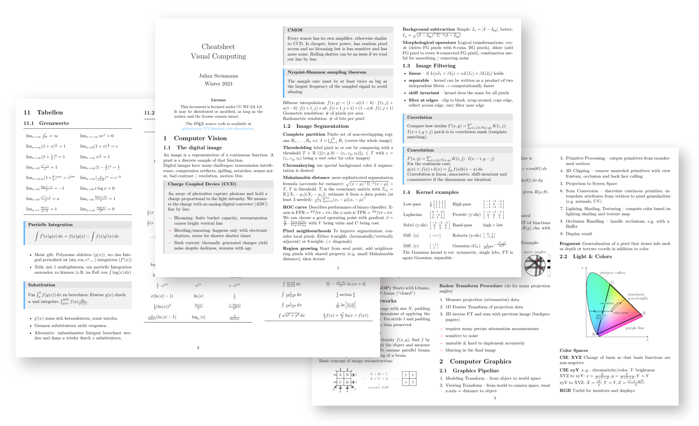

# eth-cheatsheets

A collection of LaTeX cheatsheets for the Computer Science program at ETH Zurich. 

Currently, the following cheatsheets are hosted here:

- Analysis 1 (whole course, includes table with common derivatives/integrals)
- Analysis 2 (whole course)
- Algorithms & Datastructures - an overview of all important graph terminology
- Algorithms & Probability - an overview of runtimes of the covered algorithms
- Wahrscheinlichkeit & Statistik (whole course, in german)
- Visual Computing (whole course)

You can find compiled `.pdf`s based on the latest source files in the Release section.

The `.tex` files are licensed as MIT and the `.pdf`s are CC-BY-SA 4.0. I have no clue if this even works out legally. Whatever, feel free to reuse and modify them (and please report any errors you find).
